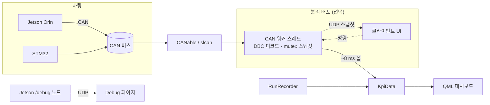

# KPI System Monitor

자율주행 ADAS 차량(Jetson Orin · STM32 · Raspberry Pi 5)의 실시간 KPI를 모니터링하는 **Qt 6 / QML 대시보드**입니다. 차량 **CAN 버스**를 직접 읽어 추론 성능 · 인식 · 측위 · 페일세이프 · HD 차선 지도 · §4.2 인수 KPI를 한 화면에서 시각화하고, 데스크톱 단독 실행은 물론 두 대의 기기로 분리(브릿지 ↔ 클라이언트)해 Wi-Fi로도 관제할 수 있습니다.

> 자율주행 ADAS 팀 프로젝트 · Team 02 (Jetson Orin Nano + STM32 + Raspberry Pi 5)

---

## 개요

차량의 모든 런타임 상태(추론 지연, 속도/조향, 장애물, 측위, 페일세이프 레벨 등)는 **CAN 버스**로 흐릅니다. 이 대시보드는 그 프레임을 프로젝트 DBC(`valeo_project_can.dbc`)로 디코드해 사람이 읽을 수 있는 KPI로 바꾸고, "값은 엔드포인트 로그가 아니라 버스에서 직접 관측한다"는 원칙으로 동작합니다. 정적 설정(KPI 임계값 · 어댑터 · 포트)만 `config.json`에 두고, 실측값은 전부 CAN에서 받습니다.

## 핵심 기능

- **AI 추론** — YOLO 추론 지연, INT8 vs FP32 속도비, GPU/CPU 사용률(작업관리자식 히스토리 그래프), 양자화별 mAP 정확도 트래커
- **주행 & 인식** — 차속 · 조향, 레이더/장애물 뷰, 인식 신뢰도
- **KPI 검증** — §4.2 인수 지표(경로편차 · 차로중심편차 · 측위 · 경로계획 · 인식)를 `PASS / WATCH / NO-DATA`로 게이팅(임계값은 `config.json` 단일 출처)
- **시스템 & 이벤트** — CAN 버스 상태, Pi5/카메라/LiDAR/IMU/엔코더 신선도, Raw CAN 프레임 모니터, 페일세이프 이벤트 스트림
- **Tactical** — HD 차선 지도 + 실시간 ego 위치·헤딩(0x10D), 지도 클릭 목적지 설정, 경로 진행률
- **Runs** — 자율주행(AUTO)을 CSV로 기록/리플레이하고 런별 KPI 평균을 집계
- **Debug** — Jetson `/debug` 토픽을 UDP로 받아 보는 실시간 디버그 콘솔(레벨 색상 · 필터)

## 시스템 아키텍처



- **워커 스레드**가 CAN을 읽어(PEAK 등은 Qt SerialBus, CANable은 COM 포트 **slcan** 직접 구현) DBC를 디코드하고 mutex로 보호된 스냅샷을 만들면, ~8 ms UI 디스패처가 QML에 전달합니다.
- **실행 모드 3종**(`config.json` → `link.mode`, 또는 `KPI_MODE`):
  - `standalone` — CAN + UI 한 프로세스 (기본)
  - `bridge` — 헤드리스. CAN을 읽어 코얼레스드 스냅샷(+ raw 프레임)을 UDP로 전송
  - `client` — UDP로 스냅샷을 받아 UI 표시 + 명령 회신. 브릿지가 클라이언트 주소를 자동 학습하므로 뷰어 IP를 하드코딩할 필요가 없음
- **Jetson 디버그 콘솔** — `jetson/debug_udp_bridge.py`가 ROS `/debug`를 등록된 모든 대시보드에 UDP로 중계

## 빌드

**Qt 6.11**(Quick · QuickControls2 · SerialBus · SerialPort) + CMake + Ninja 필요.

```bash
cmake -S . -B build -G Ninja
cmake --build build
./build/KpiProjectApp        # Windows: build\KpiProjectApp.exe
```

## 실행

- **데모 / 단독**: 그냥 실행 — CAN 어댑터가 없으면 시뮬레이션 버스로 동작
- **CANable (slcan)**: `config.json`에 `can.plugin = "slcan"`, `can.device = "COM8"`(Windows) / `"/dev/ttyACM0"`(Linux), 또는 `KPI_CAN_PLUGIN` / `KPI_CAN_DEVICE` 환경변수
- **두 대 분리**: 어댑터가 있는 노트북에서 브릿지를 켜고, 뷰어를 `link.bridge_host`(또는 `KPI_BRIDGE_HOST`)로 가리킴. SocketCAN 브릿지는 [`README-Linux.md`](README-Linux.md) 참고
- **디버그 콘솔**: `config.json`에 `debug.host = <Jetson IP>` 설정 후 Jetson에서 `python3 jetson/debug_udp_bridge.py` 실행

## 다운로드

미리 빌드된 **Windows** 패키지는 [Releases](../../releases)에 있습니다 — zip을 풀고 `KpiProjectApp.exe` 실행(Qt 설치 불필요).

## 설정

정적 설정은 모두 `config.json`(KPI 임계값 · CAN 어댑터 · UDP 포트 · HD 지도 경로 · 디버그 호스트)에 있고, 실측값은 CAN에서 옵니다.

## 저장소 구조

```
src/            C++ (CAN 브릿지 · 디코더 · UDP 링크 · 레코더 · 설정)
qml/kpi/        QML UI 페이지 + 컴포넌트
maps/           HD 차선 + occupancy 지도
jetson/         Jetson 측 헬퍼 노드(디버그 콘솔)
ios/            iOS 배포 템플릿
valeo_project_can.dbc   CAN 데이터베이스
config.json     런타임 설정
```
